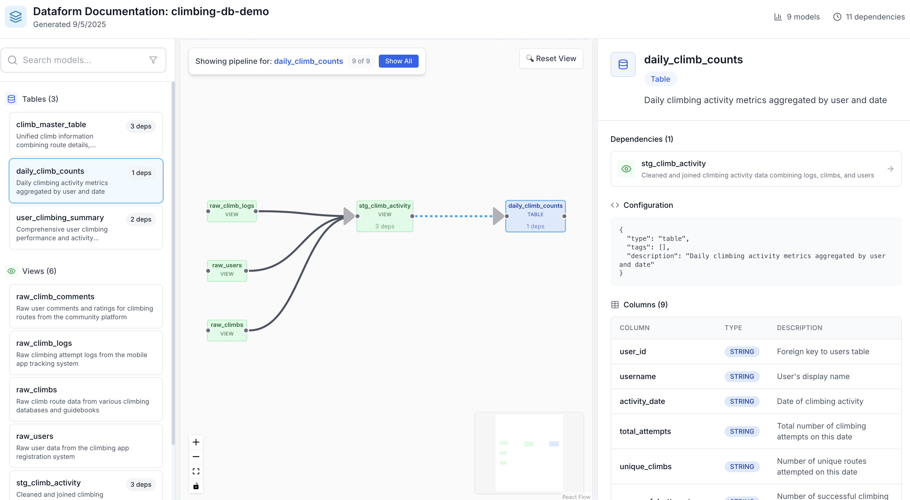

# dataform-docs

Generate beautiful, interactive documentation for your Dataform projects with dependency graphs, pipeline isolation, and auto-zoom functionality.

## Features

✨ **Interactive Dependency Graph** - Visualize your entire data pipeline with hierarchical DAG layout  
🔍 **Pipeline Isolation** - Focus on specific models and their dependencies  
🎯 **Auto-zoom** - Automatically zoom to isolated pipelines for better visibility  
📊 **Column Definitions** - View table schemas and column descriptions  
🚀 **Fast & Static** - Generates self-contained HTML that can be hosted anywhere

## Demo

🌟 **[View Live Demo](https://jnakagawa.github.io/dataform-climbing-docs/)** - Interactive climbing database documentation




## Requirements

- **Node.js** 16 or higher
- **Dataform CLI** - Automatically installed as a dependency for optimal column extraction and compilation

## Quick Start

The easiest way to use dataform-docs is with npx (no installation required):

```bash
# From your Dataform project directory
npx dataform-docs generate
npx dataform-docs serve
```

Open http://localhost:4200 to view your documentation.

## Installation

### Global Installation (Recommended)

```bash
npm install -g dataform-docs
```

Then from any Dataform project:

```bash
dataform-docs generate
dataform-docs serve
```

### Local Installation

```bash
npm install --save-dev dataform-docs
```

Add to your `package.json` scripts:

```json
{
  "scripts": {
    "docs:generate": "dataform-docs generate",
    "docs:serve": "dataform-docs serve",
    "docs": "dataform-docs generate && dataform-docs serve"
  }
}
```

## Usage

### Generate Documentation

```bash
dataform-docs generate [options]

Options:
  -p, --project <path>  Path to Dataform project (default: current directory)
  -o, --output <path>   Output directory for documentation (default: ./dataform-docs)
  -c, --config <path>   Path to dataform.json config file
```

### Serve Documentation

```bash
dataform-docs serve [options]

Options:
  -d, --docs <path>     Path to generated docs (default: ./dataform-docs)
  --port <number>       Port number (default: 4200)
  --host <string>       Host address (default: localhost)
  --no-open            Don't open browser automatically
```

## Deploy to GitHub Pages

```bash
# Generate docs
dataform-docs generate -o ./docs

# Commit and push
git add docs
git commit -m "Update documentation"
git push

# Enable GitHub Pages from /docs folder in repository settings
```

## Requirements

- Node.js 16.0.0 or higher
- A Dataform project with `dataform.json` configuration

## License

MIT
